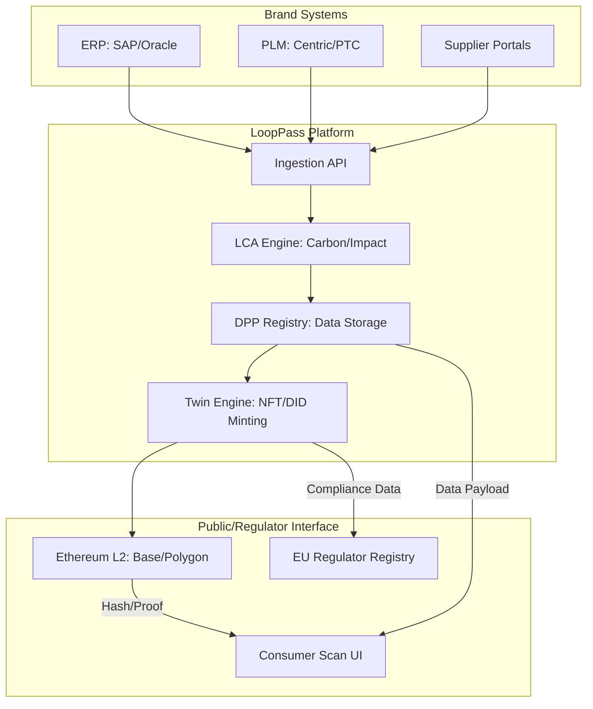

# Architecture Patterns

**Domain:** Compliance SaaS (Digital Product Passport / ESPR)
**Researched:** 2024-05-22

## Recommended Architecture: Hybrid Middleware

LoopPass acts as a "Sustainability Middleware" that bridges brands' legacy systems (SAP, Oracle, Centric PLM) with decentralized identity networks (Ethereum L2).



### Component Boundaries

| Component | Responsibility | Communicates With |
|-----------|---------------|-------------------|
| Ingestion API | Receives and validates data from ERP, PLM, and suppliers. | SAP, Centric, LCA Engine |
| LCA Engine | Calculates carbon footprint and material circularity based on raw data. | Ingestion API, DPP Registry |
| Twin Engine | Mints product-level NFTs/DIDs on L2 and anchors data hashes. | Ethereum L2, DPP Registry |
| DPP Registry | Stores detailed, item-level metadata and serves it via GS1 Digital Link. | Consumer Scan UI, Twin Engine |

### Data Flow

1. **Brand Ingestion**: SAP pushes the Manufacturing BOM (MBOM) and batch IDs to LoopPass API.
2. **Material Mapping**: PLM data (chemical/material composition) is merged with MBOM to create the complete product profile.
3. **Calculation**: LCA Engine calculates the carbon footprint for that specific unit/batch.
4. **Minting**: Twin Engine generates a unique ID, mints an NFT on L2 (storing a cryptographic hash of the profile), and updates the DPP Registry.
5. **Consumption**: A consumer scans the QR code on the physical product, which triggers a lookup in the DPP Registry via the GS1 Digital Link resolver.

## Patterns to Follow

### Pattern 1: Selective Disclosure (GDPR/IP Protection)
**What:** Storing detailed supplier data in a private, encrypted registry while exposing only the necessary compliance hashes to the public blockchain.
**Why:** Protects sensitive brand IP (supplier names, pricing) while satisfying regulators.

### Pattern 2: GS1 Digital Link Resolver
**What:** Using the standard `brand.com/01/GTIN/21/SERIAL` format for QR codes.
**Example:**
```typescript
// Resolver pattern
async function resolveDPP(qrCode: string) {
  const { gtin, serial } = parseGS1Link(qrCode);
  const metadata = await registry.getMetadata(gtin, serial);
  return formatConsumerUI(metadata);
}
```

## Anti-Patterns to Avoid

### Anti-Pattern 1: "On-Chain Everything"
**What:** Storing full product metadata (images, material lists) directly in the NFT's data field.
**Why bad:** Prohibitively high gas costs even on L2, poor scalability, and lack of updateability.
**Instead:** Use an off-chain registry with an on-chain "Trust Anchor" (hash).

## Scalability Considerations

| Concern | At 100 users | At 10K users | At 1M+ users (H&M/Zara) |
|---------|--------------|--------------|-------------|
| Minting Volume | Direct minting | Batch minting (Merkle Trees) | L2 Rollups + Off-chain State Channels |
| Data Storage | Single DB | Read-replicas | Distributed, Sharded Registry |
| ERP Sync | Webhooks / Polling | Message Queues (SQS) | Event-driven architecture (Kafka) |

## Sources

- [Digital Product Passport Interoperability Framework (CIRPASS)](https://cirpassproject.eu/outcomes/)
- [W3C Decentralized Identifiers (DIDs) Specification](https://www.w3.org/TR/did-core/)
